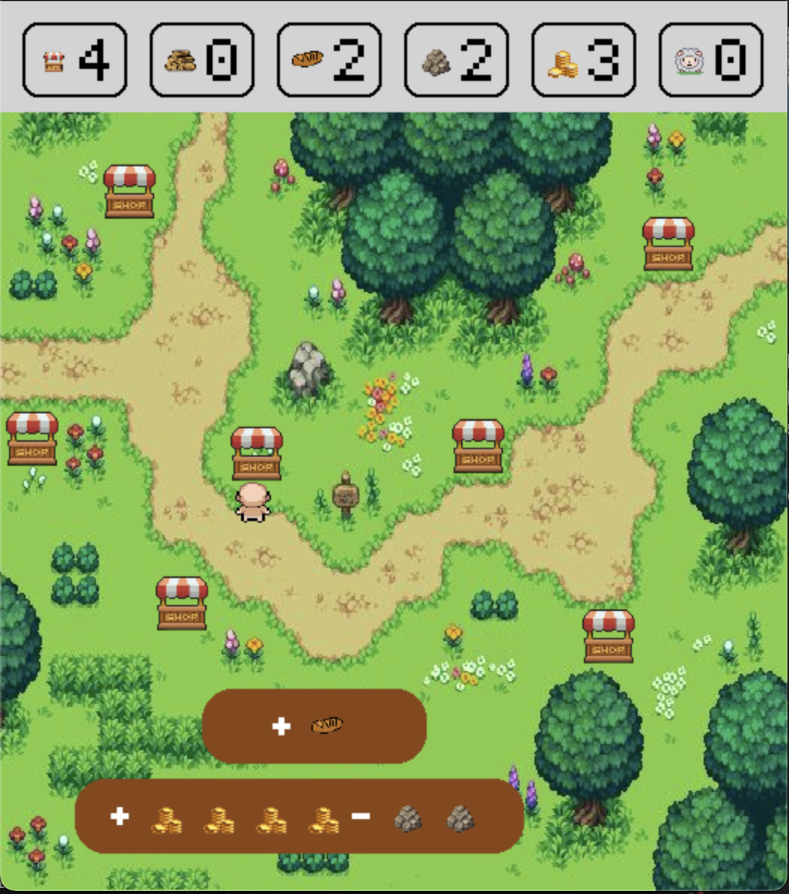

# Resource minigame



## Overview
From an exam question in Algos II. I sounded like it could be a cool and cute game. So I made it :)

## How to play | Rules

Download the repo.
Install the dependencies and run:
``` 
pip3 install pygame
python3 game.py
```
- Over ten rounds choose a free resource or trade resources.
- Your final score is the square sum of you resources
- You cannot have more than 10 of each resource at any time.
- There may be a time where you are forced to pick collect or trade due to the other being impossible.
- It will never be the case that both are impossible
